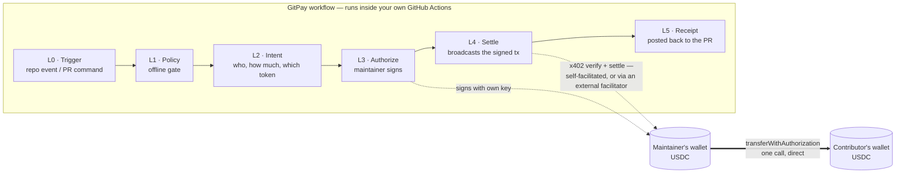
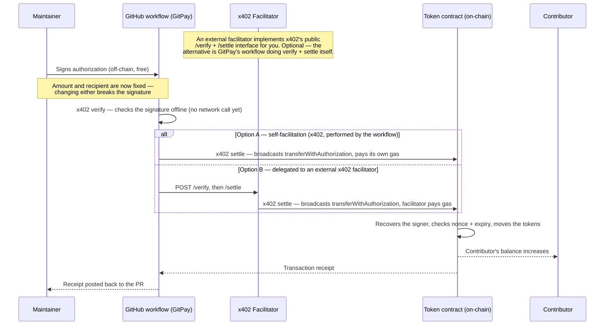

# GitPay Settlement Flow

How a payment actually moves: a signature travels through GitPay's workflow, but the token
itself moves once, on-chain, directly between two wallets — GitPay's own code is never a party
to that transfer.

## Where "x402" actually fits

x402 isn't a separate add-on — it's the shared specification the whole pipeline already follows.
It defines two things used in the diagrams below:

1. **The shape of the data at every stage** — a payment requirement, a signed payload, a
   settlement result. Every layer (L0–L5) passes around these same three x402-defined shapes,
   regardless of network or mode.
2. **Two actions that always have to happen: `verify` and `settle`.** Verify checks the
   signature is valid; settle broadcasts it on-chain. x402 doesn't require a separate party to
   do these — it explicitly supports **self-facilitation**, where the same workflow that needs
   the payment done also performs verify + settle itself, in-process
   (`docs.x402.org/core-concepts/facilitator`). Calling out to an external **facilitator** over
   HTTP (`/verify`, `/settle`) is the other option, not a requirement.

So x402 is present in **both** paths below — it's the format and the two actions, not a
specific server. "Option A" is x402's self-facilitation pattern: GitPay's own workflow verifies
and settles the payment itself. "Option B" delegates those same two actions to an external
facilitator instead. Either way, GitPay only ever produces or checks x402-shaped data; the
difference is only who executes verify + settle.

## Not this vs. actual

**Not this:** PR merges → a private key signs a claim message → the contributor pastes it into
a frontend → the contributor submits their own redemption transaction against a reserve
contract.

**Actual mechanism:** a repo event (usually a maintainer command in the PR conversation) starts
it → the maintainer signs one authorization with their own wallet → the workflow, or an x402
facilitator, broadcasts it → tokens move directly to the contributor. No reserve contract, no
claim step, no frontend redemption.

## Overview: pipeline vs. money

No box in the `GP` pipeline ever holds the token — only a signature travels through it. The
actual transfer is the bold arrow at the bottom, straight from the maintainer's wallet to the
contributor's.

## Zoom in: signature → contributor's wallet

**Why this is safe either way:** whoever pays the network fee — the workflow itself, or a
facilitator — has no power over the money. The amount and recipient were already locked into
the signature when the maintainer signed it; changing either would invalidate it. The fee-payer
only relays what was already signed. The token contract itself re-checks the signature on-chain
before moving anything, so GitPay (and the facilitator) are trusted with nothing more than
delivery.

This holds even further than "self or facilitator." Per [AGENTS.md](AGENTS.md#L232-L234):
*"Front-running is harmless here. The authorization commits to `to`. Anyone who broadcasts it
pays our gas and the intended recipient still receives the exact amount."* Literally anyone who
gets hold of the signed payload could broadcast it early and pay the gas themselves — it would
change nothing about who gets paid or how much. That's not a fallback path GitPay would ever
rely on, but it's the clearest proof that the broadcaster never has any power over the money.

## Layers, in plain terms

| Layer | What it does |
|---|---|
| L0 Trigger | A repo event becomes an Intent — usually a maintainer command in the PR conversation, not necessarily the merge itself. |
| L1 Policy | Offline checks before anything touches a chain: who's allowed, is there a payout cap, is the kill switch on. |
| L2 Intent | The intent becomes a plain description of what's owed: recipient, amount, token, network, expiry. |
| L3 Authorize | The maintainer signs that exact payment with their own wallet — a signature only, no gas. |
| L4 Settle | x402's verify + settle actions run against the signed authorization — performed by the workflow itself (self-facilitation), or delegated to an external facilitator that needs no secrets in the repo. |
| L5 Receipt | The result is posted back to the PR and written as a machine-readable record. |

## Enforced invariants (per AGENTS.md)

- **I2** — GitPay never holds, pools, or routes funds.
- **I5** — default mode is dry-run; real settlement is explicit opt-in.
- **I6** — signatures verify offline, zero network calls.
- **I8** — a repeated payment reports success, never a duplicate.
